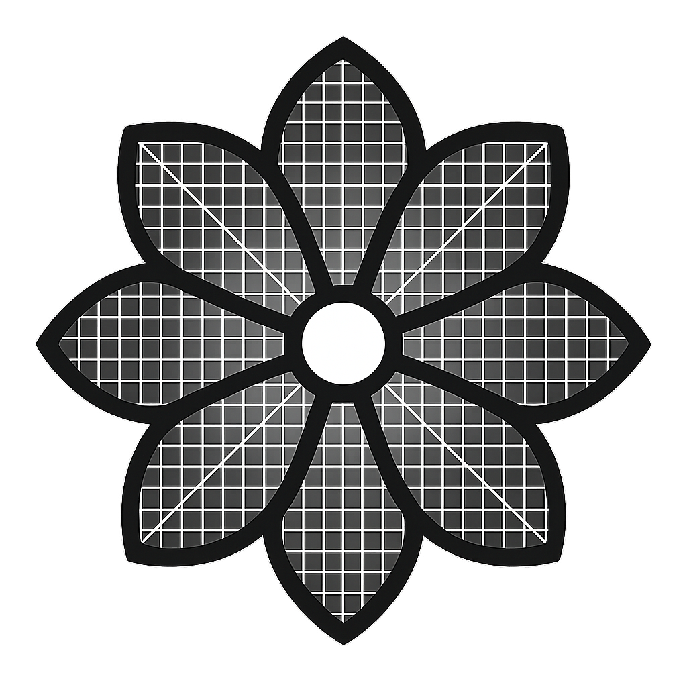
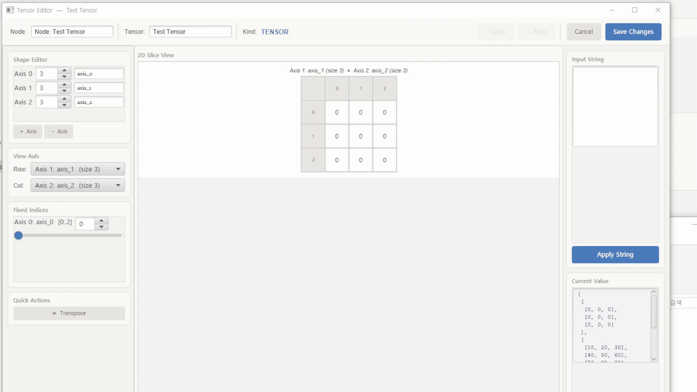
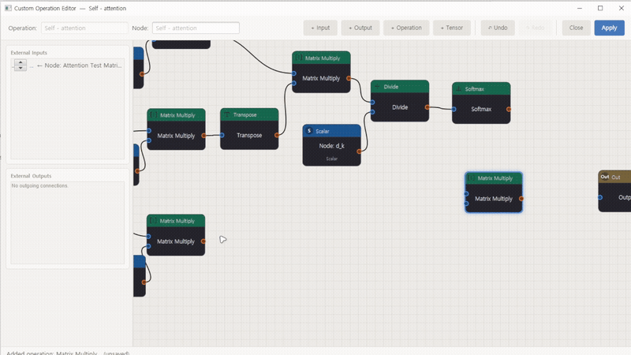
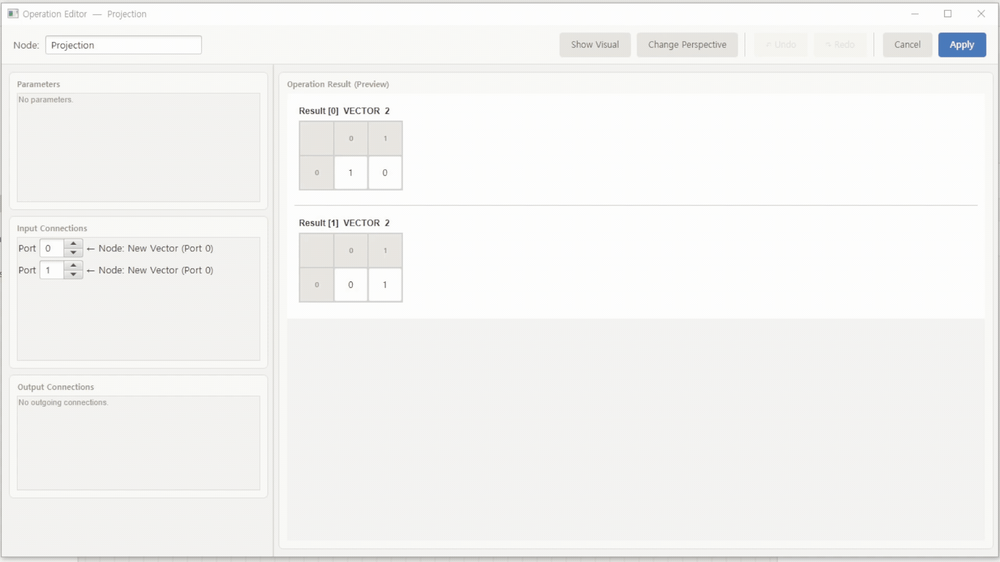

# FLOLA - Linear Algebra Editor

**한국어** | [English](README.md)


<div align="center">
  
</div>

**FLOLA (Flow of Linear Algebra)** 는 선형대수학 연산을 쉽게 실행하고, 노드&그래프 구조를 통해 복합적인 연산을 시각화 및 저장할 수 있는 선형대수학 종합 에디터입니다.

- 벡터, 행렬 등의 데이터를 생성하여 편집하고, 다차원 텐서 데이터를 **코드 작성 없이** 자유롭게 다룰 수 있습니다.
- 사칙연산, 정사영, 행렬분해 등 다양한 미리 정의되어 있는 연산을 통해 쉽게 원하는 결과값을 확인할 수 있습니다.
- 노드를 연결하여 복합적인 연산 과정을 한눈에 알아볼 수 있게 표현 및 저장할 수 있습니다.
- 직접 만든 연산 구조를 노드로 저장할 수 있어 **인공지능 모델과 같은 복잡한 구조를 구현하고 부담 없이 편집 및 사용**할 수 있습니다.

원래는 학부 기말 과제였던 프로그램의 기능과 UI를 다듬어 만든 프로그램입니다.

<br>

## 📸 데모

<div align="center">
  
</div>
<div align="center">
  
</div>
<div align="center">
  
</div>

<br>

## ⬇️ 다운로드 (바로 실행)

1. [**Releases**](https://github.com/hemisus/flola/releases) 페이지에서 최신 `FLOLA-vX.X.X-windows-x64.zip`을 다운로드합니다.
2. 압축을 풀고 **`FLOLA.exe`** 를 실행합니다. — **Java 설치가 필요 없습니다** (실행에 필요한 런타임이 포함되어 있습니다).

> 현재 **Windows 64-bit** 빌드만 제공됩니다.
>
> ⚠️ 코드 서명이 되어 있지 않아 첫 실행 시 Windows SmartScreen 경고("Windows의 PC 보호")가 나타날 수 있습니다. **추가 정보 → 실행**을 누르면 정상 실행됩니다.

<br>

## ✨ 주요 기능

### 텐서 데이터 편집
- 스칼라 / 벡터 / 행렬 / 고차원 텐서를 직접 생성하고 값을 편집
- Shape 변경, 축(axis) 이름 지정 등 세부 편집 지원
- NumPy 브로드캐스팅 규칙 지원

### 미리 정의된 연산 (총 24종)

| 카테고리 | 연산 |
|---|---|
| **Basic Operation** | Add, Subtract, Matrix Multiply, Elementwise Multiply, Divide, Negate, Transpose, Clear, Sum, Average |
| **Activation Function** | ReLU, Sigmoid, Tanh, Softmax |
| **Advanced** | Projection(정사영), Concatenate, Split, View(reshape), Conv2D, ConvTranspose2D, MaxPool2D, Upsample, SVD, Eigenvalues |

### 노드 기반 그래프 에디터
- 노드를 드래그하여 캔버스에 배치, 연결
- 모든 편집(노드 추가·삭제·이동·연결·값 수정 등)에 대한 **다단계 Undo / Redo** 지원
- 캔버스 확대/축소, 화면 이동, 노드 다중 선택 및 복사 등의 에디터 기능

### 커스텀 노드(서브그래프) 저장
- 직접 구성한 연산 그래프를 하나의 재사용 가능한 커스텀 연산 노드로 캡슐화
- 인공지능 모델처럼 복잡한 연산 구조도 부담 없이 구현하고 재사용

<br>

## 📖 사용법

자세한 사용법은 [User Guide (PDF)(한국어)](docs/FLOLA_DOC_KR.pdf)에서 확인하실 수 있습니다.

## 🛠 기술 스택

- **Language**: Java 25
- **GUI**: JavaFX 26.0.1 (`javafx.controls`, `javafx.fxml`, `javafx.graphics`)
- **직렬화**: Gson 2.10.1 — 그래프/텐서 저장·불러오기
- **빌드 도구**: Maven (`javafx-maven-plugin`, `maven-shade-plugin`)
- **배포**: `jpackage` — 런타임을 포함한 단독 실행 이미지 생성

<br>

## 📁 프로젝트 구조

```
com.hemisus.flola
├── controller  # MainController 등 FXML 컨트롤러 + Undo/Redo(GraphCommand) 인프라
├── event       # ShapeChangeListener 등 이벤트 인터페이스
├── model       # Graph, GraphNode, OperationNode, TensorNode, Tensor, ConnectionModel,
│               # CustomOperation, CustomOperationNode, GenericOperationNode 등 핵심 모델 클래스
├── ui          # CanvasPane, NodeView, PortView, ConnectionLayer,
│               # TensorEditorStage, OperationEditorStage 등 에디터 UI
├── utils       # TensorOperations(연산 구현), OperationRegistry(연산 등록/조회),
│               # GraphStorageJson(저장/불러오기), DataConverter
└── viewmodel   # NodeViewModel, TensorViewModel 등 에디터 UI 상태(드래프트, Undo/Redo) 관리
```

<br>

## 🚀 소스에서 빌드 / 개발

**요구 사항**: JDK 25 이상, Maven

```bash
git clone https://github.com/hemisus/flola.git
cd flola

# 1) 개발용 실행
mvn clean javafx:run

# 2) 실행 가능한 jar 빌드  →  target/flola.jar
mvn clean package
java -jar target/flola.jar      # 실행에는 JDK 25가 설치되어 있어야 함
```

### 단독 실행 파일(.exe) 만들기 — jpackage

jpackage로 런타임을 포함한 Windows 실행 이미지를 생성할 수 있습니다. (Windows에서 실행, 산출물은 `dist/FLOLA/FLOLA.exe`)

```bat
mvn clean package
mkdir jpackage-input
copy target\flola.jar jpackage-input\
jpackage --type app-image --name FLOLA --input jpackage-input ^
         --main-jar flola.jar --main-class com.hemisus.flola.Launcher ^
         --app-version X.X.X --icon flola.ico --dest dist
```

<br>

## 향후 계획

시간날때 틈틈이 UI나 기능들을 직접 사용해보며 계속해서 업데이트할 예정입니다.

최대한 테스트 해보았으나 여전히 버그가 존재할 수 있습니다. 버그나 개선할 점이 있으시면 언제든 편하게 [Discussions](https://github.com/hemisus/flola/discussions)에 남겨주시거나 연락주시면 업데이트 하겠습니다.

<br>

## 📄 License

This project is licensed under the [MIT License](LICENSE).

<br>

## 📬 Contact

- Email: hydro6323@gmail.com
- GitHub: [@hemisus](https://github.com/hemisus)
- Discord: hemisus_